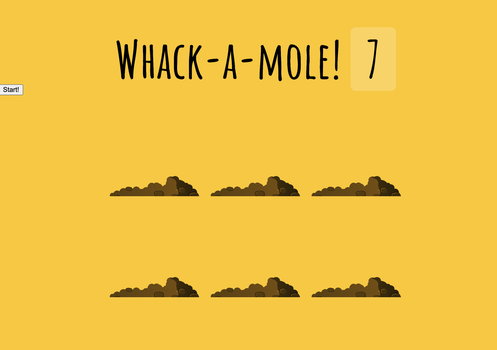

# Whack-a-mole
This is a 30-days javascript grinding  
js30 [https://github.com/ningh98/js30]  
30. Whack-a-mole [https://github.com/ningh98/Whack-a-mole]

## Table of contents

- [Overview](#overview)
  - [Screenshot](#screenshot)
  - [Links](#links)
- [My process](#my-process)
  - [Built with](#built-with)
  - [What I learned](#what-i-learned)


## Overview

The "Whack-a-Mole" game is a classic browser-based game where players score points by clicking on moles that randomly appear in different holes. The JavaScript code handles the game logic, including randomizing mole appearances and updating the score.

### Screenshot




### Links

- Live Site URL: [https://ningh98.github.io/Whack-a-mole/]

## My process

### Built with

- HTML
- CSS
- Javascript


### What I learned


```js

const holes = document.querySelectorAll('.hole');
  const scoreBoard = document.querySelector('.score');
  const moles = document.querySelectorAll('.mole');
  let lastHole
  let timeUp = false
  let score = 0

  function randomTime(min, max){
    return Math.round(Math.random() * (max - min) + min)
  }

  function randomHole(holes){
    const idx = Math.floor(Math.random() * holes.length)
    const hole = holes[idx]
    if(hole === lastHole){
      console.log('same one')
      return randomHole(holes)
    }
    

    lastHole = hole
    return hole
  }

  function peep(){
    const time = randomTime(200, 1000)
    const hole = randomHole(holes)
    hole.classList.add('up')
    setTimeout(() =>{
      hole.classList.remove('up')
      if(!timeUp) peep()
      
    }, time)
  }

  function startGame(){
    scoreBoard.textContent = 0
    timeUp = false
    score = 0
    peep()
    setTimeout(() => timeUp = true, 10000)
  }

  function bonk(e){
    if(!e.isTrusted) return
    score++
    this.classList.remove('up')
    scoreBoard.textContent = score
  }

  moles.forEach(mole => mole.addEventListener('click', bonk))

```
